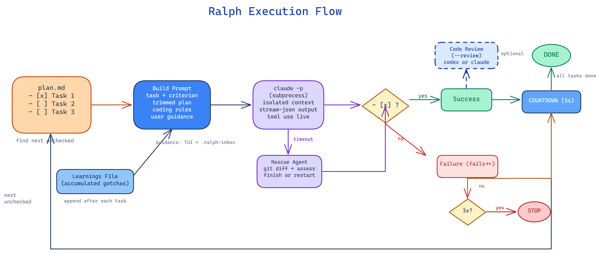
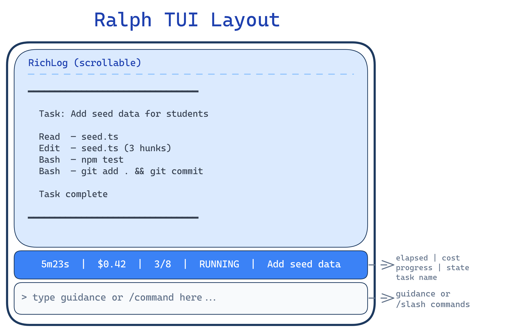
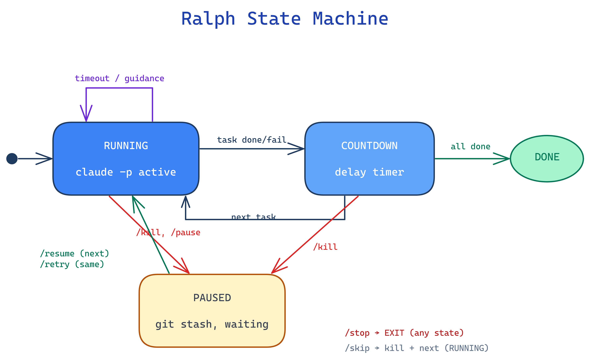

# Ralph

Ralph is a task-by-task plan executor for Claude Code. It reads a markdown plan file, dispatches each unchecked task to a fresh `claude -p` subprocess with zero context carryover, and checks tasks off as they complete. A learnings file accumulates gotchas across iterations so each fresh context window inherits institutional knowledge.

Named after Ralph Wiggum — he's doing his best.

## How It Works



### Detailed Workflow

Each iteration of the task loop:

1. **Find next task** — scan the plan file for the first unchecked `- [ ]` line (optionally filtered by `--phase`)
2. **Parallel detection** — if the task falls inside a `<!-- PARALLEL -->` group, Ralph spawns parallel worktrees instead of running sequentially (see [Parallel Execution](#parallel-execution))
3. **Collect context** — load the learnings file, coding rules (`CODING_AGENTS.md`), project context (`README.md`/`PROJECT_STRUCTURE.md`), recent git commits, and any queued user guidance
4. **Trim plan** — the plan is trimmed to only the current phase section (other phases replaced with `[... completed phases omitted ...]`) to keep prompt size manageable
5. **Build prompt** — assemble a structured prompt with the task, its completion criterion, trimmed plan, and all context
6. **Execute** — run `claude -p --dangerously-skip-permissions --verbose --output-format stream-json` as a subprocess; stream-parse tool use events, token counts, and cost
7. **Check result** — re-read the plan file; if the task line changed from `- [ ]` to `- [x]`, it's a success; otherwise a failure
8. **Review** (optional) — if `--review` is enabled, diff the working tree against the pre-task HEAD and run a code review via Codex or Claude; auto-fix any findings
9. **Append learning** — record a one-liner to the learnings file (pass/fail + any gotcha the agent discovered)
10. **Countdown** — wait `--delay` seconds before the next task (guidance can be queued during this time)

The loop stops when all tasks are checked off, 3 consecutive failures occur, or a usage limit is hit.

## TUI Interface

Ralph runs as a Textual terminal app with three regions:



### Commands

| Command    | Description                                     |
|------------|-------------------------------------------------|
| `/skip`    | Kill current task, move to next                 |
| `/stop`    | Kill current task, stash changes, exit           |
| `/kill`    | Kill current task, stash changes, pause          |
| `/pause`   | Pause after current task finishes                |
| `/resume`  | Unpause, pop stash, move to next task            |
| `/retry`   | Unpause, pop stash, re-run same task             |
| `/plan`    | Show plan progress                               |
| `/help`    | Show command help                                |

Type anything else to queue guidance for the next task.

### State Machine



## Usage

### Via Claude Code skill

```
/ralph                          # auto-find plan.md
/ralph path/to/plan.md          # explicit plan
/ralph plan.md --model sonnet   # use Sonnet
```

### Direct invocation

```bash
python3 ~/.claude/skills/ralph/ralph.py [plan_path] [options]
```

### Options

| Flag              | Default | Description                              |
|-------------------|---------|------------------------------------------|
| `--dry-run`       | off     | Preview tasks without running claude      |
| `--delay`         | 5       | Seconds between tasks                    |
| `--batch`         | off     | Execute `<!-- BATCH -->` groups together |
| `--review`        | off     | Code review after each task              |
| `--model`         | —       | Model preset or raw model ID             |
| `--reviewer`      | auto    | Reviewer: `auto`, `codex`, or `claude`   |
| `--phase`         | —       | Only execute tasks under `## Phase N` heading |
| `--task-timeout`  | 3600    | Kill stuck tasks after N seconds (0 to disable) |

Environment variables: `RALPH_MODEL`, `RALPH_DELAY`, `RALPH_REVIEWER`, `RALPH_TASK_TIMEOUT`.

### Interactive Launcher

When no flags are provided, Ralph presents an interactive menu (using [fzf](https://github.com/junegunn/fzf) if installed, numbered menu otherwise) to select:
1. Plan file (searched in `./`, `./plans/`, `~/.claude/plans/`)
2. Model preset
3. Review toggle and reviewer

### Model Presets

| Preset        | Model              | Effort |
|---------------|--------------------|--------|
| `opus-max`    | Claude Opus 4.6    | max    |
| `opus-high`   | Claude Opus 4.6    | high   |
| `opus-med`    | Claude Opus 4.6    | medium |
| `opus`        | Claude Opus 4.6    | —      |
| `sonnet-high` | Claude Sonnet 4.6  | high   |
| `sonnet`      | Claude Sonnet 4.6  | —      |
| `haiku`       | Claude Haiku 4.5   | —      |

## Plan Format

Plans are standard markdown with checkbox tasks:

```markdown
# My Plan

## System Tools & Dependencies
- Python 3, pytest, git

## Phase 1: Setup
- [ ] Verify dependencies are installed — _Criterion: commands exit 0_

## Phase 2: Build
- [ ] Create the widget — _Criterion: tests pass, committed_
- [ ] Add error handling — _Criterion: edge cases covered_

## Phase 3: Polish
- [ ] Write documentation — _Criterion: README exists_
```

### Task format

```
- [ ] Task description — _Criterion: what success looks like_
```

The criterion after the em dash tells the agent how to verify completion. If omitted, Ralph defaults to "Task is complete and working correctly."

### Batch tasks

Mark consecutive tasks for single-shot execution:

```markdown
<!-- BATCH -->
- [ ] Task A — criterion
- [ ] Task B — criterion
- [ ] Task C — criterion
```

All three run in one `claude -p` invocation with `--batch`.

### Parallel phases

Mark phases for concurrent execution with a `<!-- PARALLEL -->` comment listing phase numbers:

```markdown
<!-- PARALLEL 2,3,4 -->

## Phase 2: Backend API
- [ ] Create REST endpoints — _Criterion: tests pass_

## Phase 3: Frontend UI
- [ ] Build dashboard components — _Criterion: renders correctly_

## Phase 4: Database
- [ ] Set up migrations — _Criterion: migrate up/down works_
```

When Ralph encounters a task inside a parallel group, it orchestrates all listed phases concurrently:

1. **Create worktrees** — one git worktree per phase, branched from HEAD (`ralph/phase-N`)
2. **Launch tmux** — a tmux session (`ralph-parallel`) with one window per phase, each running a separate Ralph instance scoped to its phase via `--phase N`
3. **Wait** — Ralph blocks until all tmux windows exit
4. **Merge** — branches are merged back sequentially; the first branch fast-forwards, subsequent branches are rebased onto the updated main; if rebase conflicts occur, a Claude agent attempts automatic resolution
5. **Cleanup** — worktrees and temporary branches are removed

The shared learnings file is used across all parallel instances (with file locking via `fcntl`) so discoveries in one phase are visible to others.

**Requirements:** git, tmux

**Monitoring:** `tmux attach -t ralph-parallel` to watch all phases live.

## Guidance

Three ways to send guidance to the next task:

1. **TUI input** — type in the input bar, hit enter
2. **Inbox file** — `echo "use the new API" > .ralph-inbox` from any terminal
3. **During countdown** — type while the countdown timer is running

## Learnings File

Ralph automatically maintains a learnings file alongside your plan. If your plan is `plans/my-project.md`, the learnings file will be `plans/my-project-learnings.md`.

**How it works:**
- Each task prompt includes the full learnings file, so every fresh context window sees gotchas from prior iterations
- Claude is instructed to append a learning only when it discovers something surprising — a workaround, environment quirk, non-obvious dependency, or dead end worth avoiding
- Ralph also appends a fallback one-liner (task name + timestamp + pass/fail) as a safety net if Claude forgets

**Example entries:**
```
[done 2026-03-23 14:30] Set up auth middleware. ⚠️ Learning: bcrypt rounds must be ≥12 on this ARM host or tests timeout
[FAILED 2026-03-23 14:45] Add rate limiting
[done 2026-03-23 15:10] Add rate limiting. ⚠️ Learning: redis must be running locally — tests don't mock it
```

The file is append-only. Delete it between projects or when it gets stale.

## Task Timeout & Auto-Rescue

Ralph monitors how long each task has been running (visible in the status bar). If a task exceeds the timeout (default: 1 hour), Ralph:

1. Kills the stuck agent process
2. **Keeps all code changes** in the working tree (no stash, no revert)
3. Launches a fresh "rescue" agent with context about what happened
4. The rescue agent runs `git diff`/`git status`, assesses the partial work, and finishes (or restarts) the task

If the rescue agent also fails or times out, Ralph counts it as a failure and moves on.

Configure with `--task-timeout <seconds>` or `RALPH_TASK_TIMEOUT`. Set to `0` to disable.

## Gemini Fallback (Review Only)

If Claude hits a usage or rate limit during the **review step**, Ralph automatically retries the review using Gemini CLI (`gemini -p "" --yolo`).

If Claude hits a usage limit during **task execution**, Ralph stops the loop — there's no point continuing without the primary model.

Requires [Gemini CLI](https://github.com/google-gemini/gemini-cli) to be installed and authenticated.

## Log File

All TUI output is mirrored to a log file alongside your plan. If your plan is `plans/my-project.md`, the log is `plans/my-project-ralph.log`.

- Every line is timestamped (`[HH:MM:SS] ...`)
- The log persists across runs (append mode) so you have a complete history
- Includes tool calls, agent output, task results, cost, and the final summary
- When Ralph terminates, the log file path is printed in the final summary

## Failure Handling

- If a task fails (not checked off after execution), Ralph moves on and increments a counter
- After 3 consecutive failures, Ralph stops — fix the issue manually, then re-run
- Re-running Ralph picks up from the first unchecked task automatically
- `/kill` + `/retry` lets you re-run a task with guidance after reviewing what went wrong

## Dependencies

- Python 3
- [Textual](https://github.com/Textualize/textual) (`pip install textual`)
- Claude Code CLI (`claude`)
- [tmux](https://github.com/tmux/tmux) (required for parallel execution)
- [fzf](https://github.com/junegunn/fzf) (optional, for interactive plan/model selection)
